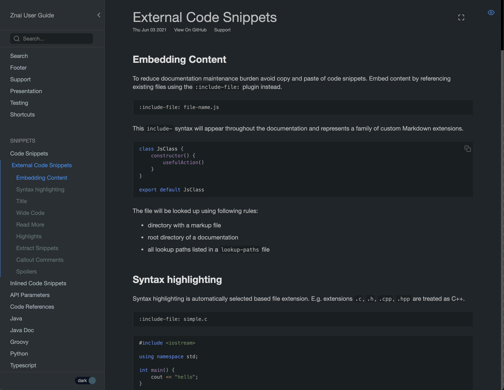

# Znai

Build functional, maintainable, beautiful User Guides with `Znai`.

* Markdown with custom extensions
* Instant pages navigation 
* Local search
* Multiple integrations to work with Python, Java, OpenAPI, etc
* Transform "getting started" sections into slideshow for your workshops.
* Leverage happy path test results to enrich you documentation
* GitHub pages friendly

# Preview

`Znai` has a preview mode to automatically listen to local files changes. It automatically navigates to a page that was 
changed (directly or indirectly) and highlights the changes.

# Docs Hub

`Znai` has a free, open-source enterprise support. You can host multiple documentations using single site. It provides
landing page to list all the company inner guides. 

It also automatically detects documentations in the builds outputs and updates hosted documentations.

Examples (including using Google Cloud) and setup documentation are coming. Please create a GitHub issue if you want
to learn more about Enterprise setup. It will help me prioritize.  

# Read More

[Znai documentation website built with Znai](https://testingisdocumenting.org/znai/)

For curios, znai word meaning: `znai` is a `to know` in Russian and is a root that words like `knoweldge` (`znanie`) are built on.  