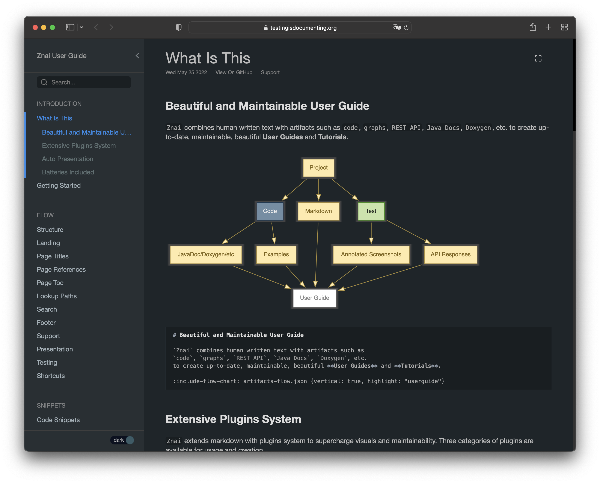
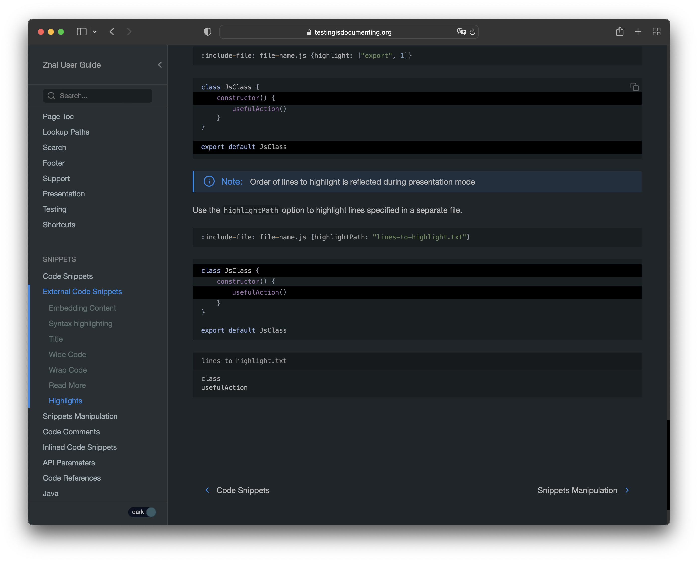
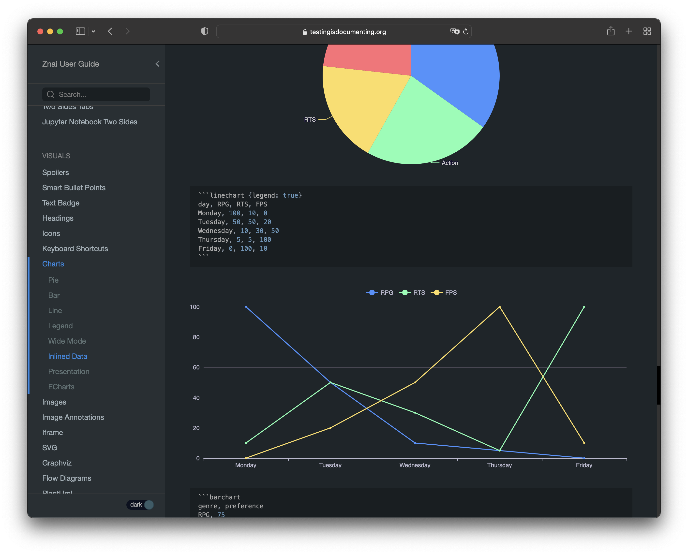
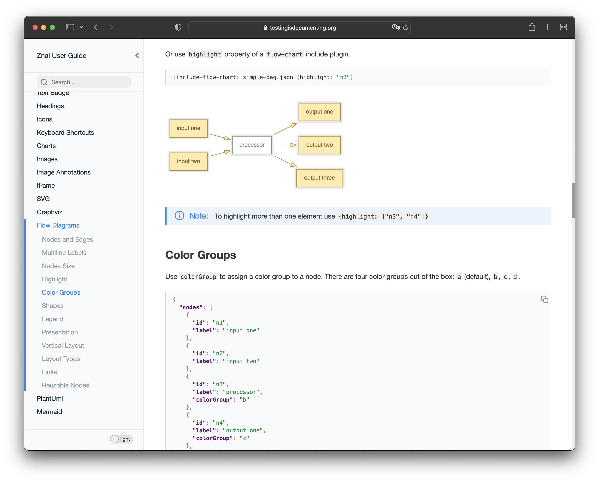
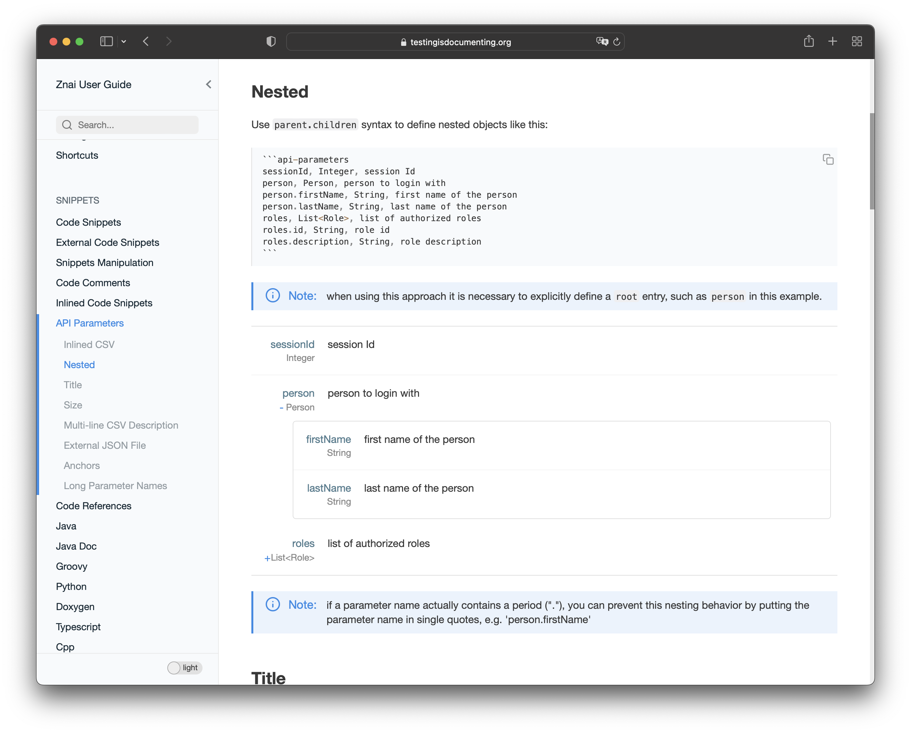
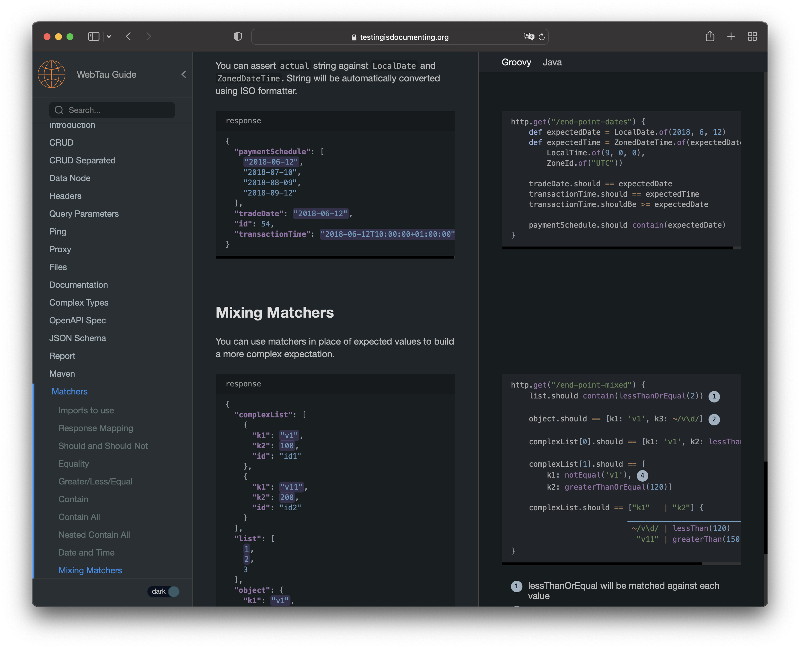
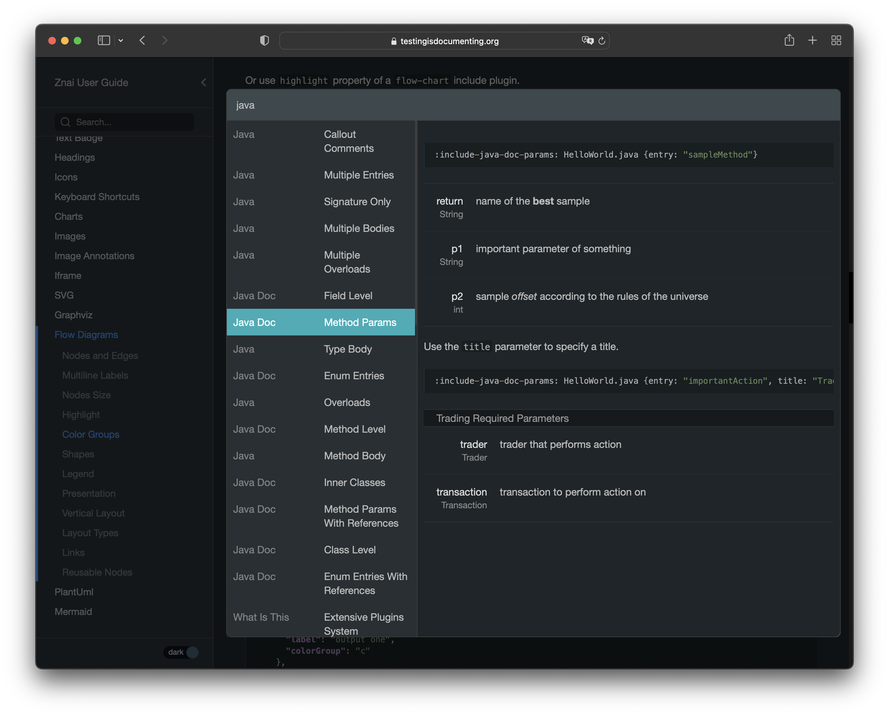
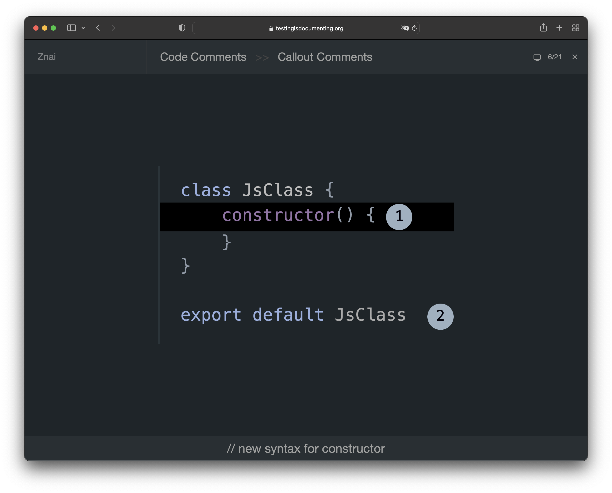

# Znai

Build functional, maintainable, beautiful User Guides with `Znai`.

* Markdown with custom extensions and dozens of plugins: 
  * Content from external files with markers and filters support
  * Simplified extraction of a function body content (working with examples) 
  * Embedding of JavaDoc/PyDoc documentation text, preserving styles
  * Beautiful API documentation capabilities  
  * Two Sides Page Layout Option with convenient example languages switch 
  * Rich visuals like flow diagrams and charts
  * etc
* Instant pages navigation 
* Local search
* Multiple integrations to work with Python, Java, OpenAPI, etc
* Presentation Mode to automatically turn your documentation into slides, using the same content
* Dark/Light runtime themes
* Leverage automated test results to enrich your documentation with annotated images, REST responses, CLI outputs, etc
* GitHub pages friendly

Embedding of [External Resources](https://testingisdocumenting.org/znai/snippets/external-code-snippets) at build time

Rich Visuals such as [Charts](https://testingisdocumenting.org/znai/visuals/charts) and [Flow Diagrams](https://testingisdocumenting.org/znai/visuals/flow-diagrams)

Dark/Light mode switching 

Beautiful way to document your API 

Use [two sides](https://testingisdocumenting.org/znai/layout/two-sides-tabs) layout option to render examples and supporting information side by side
with convenient examples language switch

Blazing fast local search with results preview

Automatic Presentation from **the same content** with zero config

# Preview

`Znai` has a preview mode to automatically listen to local files changes. It automatically navigates to a page that was 
changed (directly or indirectly) and highlights the changes.

# Docs Hub

`Znai` has a free, open-source enterprise support. You can host multiple documentations using single site. It provides
landing page to list all the company inner guides. 

It also automatically detects documentations in the builds outputs and updates hosted documentations.

Examples (including using Google Cloud) and setup documentation are coming. Please create a GitHub issue if you want
to learn more about Enterprise setup. It will help me prioritize.  

# Read More

[Znai documentation website built with Znai](https://testingisdocumenting.org/znai/)

For curios, znai word meaning: `znai` is a `to know` in Ukranian and is a prefix for words like `knoweldge` are built on.  
