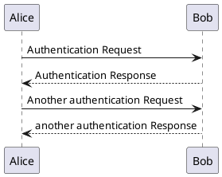

# Plant Uml

Draw sequence diagrams with [PlantUml](http://plantuml.com/sequence-diagram)

`````markdown-and-result

`````
\
Consider using [Columns Layout](features/columns) to put your story and a diagram side by side