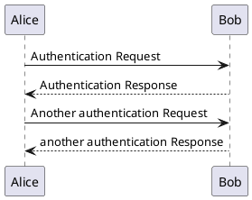

[PlantUml](https://plantuml.com/sequence-diagram) is a text-based way of drawing many kinds of diagrams.

# In Place

`````markdown-and-result

`````

# External File

If your diagram is stored in a separate file, use `:include-plantuml: <path>`.

```columns
left:
    :include-plantuml: demo.plantuml

:include-file: demo.plantuml {title: "demo.plantuml"}
right:
:include-plantuml: demo.plantuml
```

# Gantt Example

:include-file: gantt.plantuml {title: "gantt sequence"}

:include-plantuml: gantt.plantuml
    