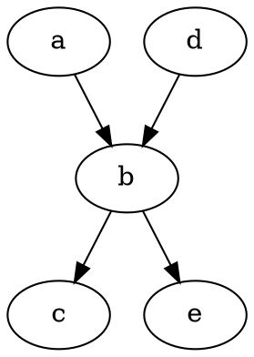

# Fenced Block

Surround [Graphviz](https://graphviz.org/) expression with `graphviz` fenced block to render diagrams 

    ```graphviz
    digraph {
     a -> b;
     b -> c;
     d -> b;
     b -> e;
    }
    ```
    


# External File

Use include plugin to render a diagram from a file

    :include-graphviz: graphviz.dot

:include-graphviz: graphviz.dot

:include-file: graphviz.dot {autoTitle: true}

# Setup Requirements

Znai renders [Graphviz](https://graphviz.org/) diagrams at documentation build time. For it to work `dot` executable must be present in `PATH` during documentation generation process. 

To override use `-Ddot.bin` Java system property to specify an alternative location. 