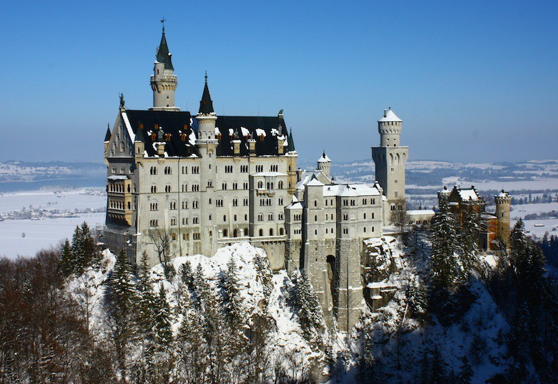

# Standard Markdown

An image can be included using standard Markdown syntax.

```markdown

```


```markdown {title: "with title"}

```


# Extension

`Znai` has `:include-image:` extension to provide additional features:
* annotations
* fit 
* scale
* alignment
* border
* presentation mode

# Title

Use `title` to add a title to an image.

    :include-image: castle.jpg {title: "beautiful castle"}
    
:include-image: castle.jpg {title: "beautiful castle"}

# Anchor

When you specify a title, hover mouse over it to see a clickable anchor.

Use `anchorId` to override auto generated identifier.

    :include-image: castle.jpg {title: "beautiful castle", anchorId: "castle-image"}

:include-image: castle.jpg {title: "beautiful castle", anchorId: "castle-image"}

# Border

Use `border: true` to include a border around image.

    :include-image: image.png {border: true}
    
:include-image: regular-image.png {border: true}

# Fit

By default image occupies all available horizontal space:

:include-image: books.jpg {title: "wide image"}

Use `fit` parameter to fit an image to the text column width.

    :include-image: books.jpg {fit: true}

Note: You can click on the scaled down images to display it full screen

:include-image: books.jpg {fit: true, title: "auto scaled down image"}

# Scale

To scale image up or down use `scale` option, `1` is default, `0.5` is half an image size.   
    
    :include-image: books.jpg {scale: 0.3}

:include-image: books.jpg {scale: 0.3}

Note: You can click on the scaled down images to display it full screen

# Align

Use `align` option to align images left or right. 

    :include-image: books.jpg {align: "left", scale: 0.3}
    
:include-image: books.jpg {align: "left", scale: 0.3}

    :include-image: books.jpg {align: "right", scale: 0.3}
    
:include-image: books.jpg {align: "right", scale: 0.3}

# Collapse

Use `collapsed: true|false` to make image collapsible.
Note: `title` option is required

```markdown {highlight: "collapsed"}
:include-image: books.jpg {
  fit: true, 
  title: "books", 
  anchorId: "my-books", 
  collapsed: true
}
```

:include-image: books.jpg {
  fit: true, 
  title: "books", 
  anchorId: "my-books", 
  collapsed: true
}

# No Gap

Use `noGap: true` to remove top/bottom margins when there are multiple images in a row.

```markdown {highlight: "noGap"}
:include-image: books.jpg {
  fit: true,
  title: "books",
  collapsed: true,
  noGap: true
}
:include-image: castle.jpg {
  fit: true,
  title: "castle",
  collapsed: false,
  noGap: true
}
```

:include-image: books.jpg {
  fit: true,
  title: "books",
  collapsed: true,
  noGap: true
}
:include-image: castle.jpg {
  fit: true,
  title: "castle",
  collapsed: false,
  noGap: true
}

# External Image

Pass external url in place of image to render image from a remote site 

    

    :include-image: https://external-url { align: "left" }

Note: Pass `:identifier: validate-external-links {validationPath: "org/testingisdocumenting/znai/cli/ZnaiCliConfig.java"}` parameter to validate image urls

# Mobile And Desktop Only

Use `mobileOnly` to only render an image in mobile screen size.
Use `desktopOnly` to only render an image in desktop screen size.

    :include-image: small-book.png {title: "only visible in mobile screen size", mobileOnly: true}
    :include-image: books.jpg {title: "only visible in desktop screen size", desktopOnly: true, fit: true}

:include-image: small-book.png {title: "only visible in mobile screen size", mobileOnly: true}
:include-image: books.jpg {title: "only visible in desktop screen size", desktopOnly: true, fit: true}