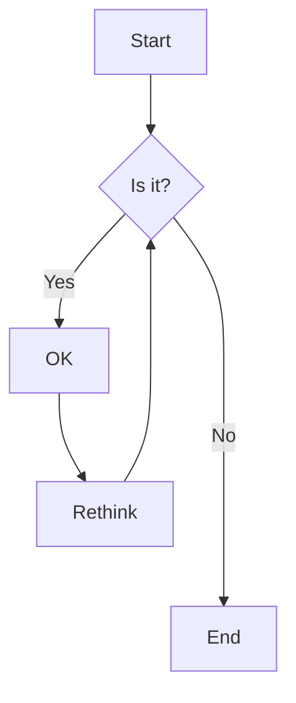
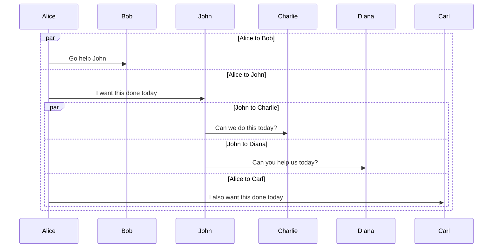

# Fenced Block

Use [Mermaid](https://mermaid-js.github.io/mermaid/#/) to create diagrams using text and code, written in a Markdown style.
Surround Mermaid expressions with a fenced block and specify `mermaid` as a language

    ```mermaid
    flowchart TD
        A[Start] --> B{Is it?}
        B -- Yes --> C[OK]
        C --> D[Rethink]
        D --> B
        B -- No ----> E[End]
    ```

The result will be a diagram.



In presentation mode, rendered expressions will automatically scale to make use of the screen space.

Note: Rendering is done by using [Mermaid](https://mermaid-js.github.io/mermaid/#/) library.

# External File

Use include plugin to render a Mermaid diagram from a file.

    :include-mermaid: mermaid/class-diagram.mmd

:include-mermaid: mermaid/class-diagram.mmd

:include-file: mermaid/class-diagram.mmd { autoTitle: true }

# Wide Mode

Use `wide: true` to use as much horizontal space as required and available.

    ```mermaid {wide: true}
    sequenceDiagram
        par Alice to Bob
            Alice->>Bob: Go help John
        and Alice to John
            Alice->>John: I want this done today
            par John to Charlie
                John->>Charlie: Can we do this today?
            and John to Diana
                John->>Diana: Can you help us today?
        and Alice to Carl
            Alice->>Carl: I also want this done today
        end
    end
    ```

or 

```
:include-mermaid: mermaid/sequence-diagram.mmd { wide: true }
```



