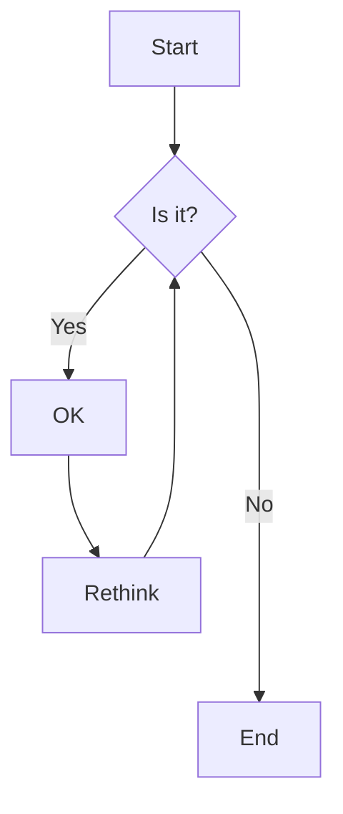
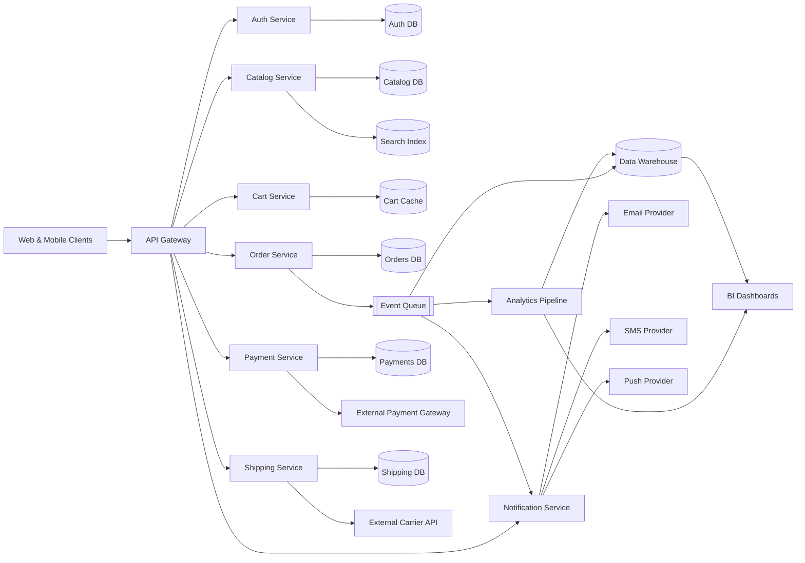
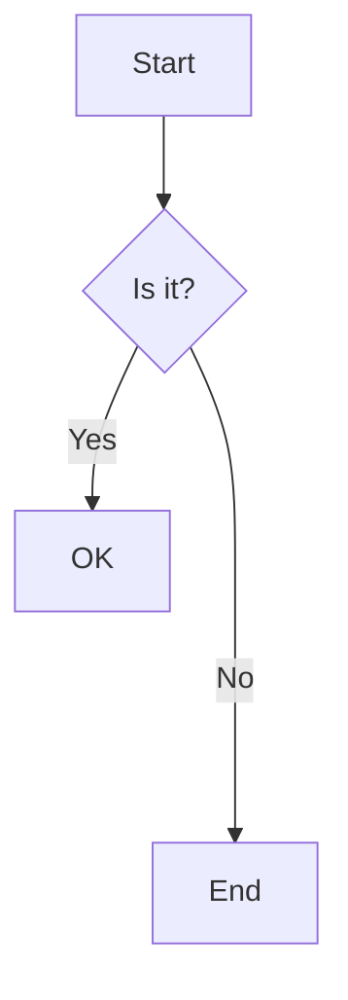
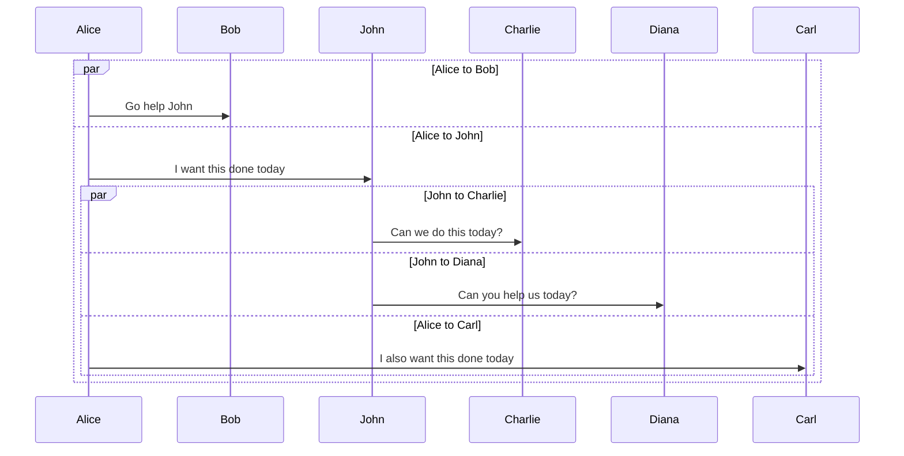

# Fenced Block

Use [Mermaid](https://mermaid-js.github.io/mermaid/#/) to create diagrams using text and code, written in a Markdown style.
Surround Mermaid expressions with a fenced block and specify `mermaid` as a language

    ```mermaid
    flowchart TD
        A[Start] --> B{Is it?}
        B -- Yes --> C[OK]
        C --> D[Rethink]
        D --> B
        B -- No ----> E[End]
    ```

The result will be a diagram.


```mermaid
flowchart TD
    A[Start] --> B{Is it?}
    B -- Yes --> C[OK]
    C --> D[Rethink]
    D --> B
    B -- No ----> E[End]
```

In presentation mode, rendered expressions will automatically scale to make use of the screen space.

Note: Rendering is done by using [Mermaid](https://mermaid-js.github.io/mermaid/#/) library.

# Large Diagrams

A diagram that is too large to fit the page width is shrunk to fit and can become hard to read.
Znai detects this automatically: hovering over such a diagram shows a `Click to zoom & pan` hint.

Click the diagram to open it in a full screen overlay where you can:

- scroll/`wheel` to zoom towards the cursor
- drag to pan
- use the `+` / `-` buttons to zoom and the fit button to fit the diagram back to the screen
- press `Escape`, click the backdrop, or use the close button to exit

No extra configuration is required &mdash; only diagrams that don't fit become zoomable, smaller diagrams render as before.

The diagram below is wider than the page, so it is shrunk to fit. Hover over it and click to zoom and pan.


```mermaid
flowchart LR
    Client[Web & Mobile Clients] --> Gateway[API Gateway]
    Gateway --> Auth[Auth Service]
    Gateway --> Catalog[Catalog Service]
    Gateway --> Cart[Cart Service]
    Gateway --> Orders[Order Service]
    Gateway --> Payments[Payment Service]
    Gateway --> Shipping[Shipping Service]
    Gateway --> Notifications[Notification Service]

    Auth --> AuthDb[(Auth DB)]
    Catalog --> CatalogDb[(Catalog DB)]
    Catalog --> Search[(Search Index)]
    Cart --> CartCache[(Cart Cache)]
    Orders --> OrdersDb[(Orders DB)]
    Orders --> Queue[[Event Queue]]
    Payments --> PaymentsDb[(Payments DB)]
    Payments --> Gatewayp[External Payment Gateway]
    Shipping --> ShippingDb[(Shipping DB)]
    Shipping --> Carrier[External Carrier API]

    Queue --> Notifications
    Queue --> Analytics[Analytics Pipeline]
    Queue --> Warehouse[(Data Warehouse)]
    Analytics --> Warehouse
    Notifications --> Email[Email Provider]
    Notifications --> SMS[SMS Provider]
    Notifications --> Push[Push Provider]

    Analytics --> Dashboards[BI Dashboards]
    Warehouse --> Dashboards

    click Catalog "visuals/graphviz-diagrams"
    click Payments href "https://mermaid.js.org" "Mermaid documentation"
```

Node links work inside the overlay too: open the diagram above and click the `Catalog` or `Payments` node.

# External File

Use include plugin to render a Mermaid diagram from a file.

    :include-mermaid: mermaid/class-diagram.mmd

:include-mermaid: mermaid/class-diagram.mmd

:include-file: mermaid/class-diagram.mmd { autoTitle: true }

# Links

Use mermaid `click` statements to add links to diagram nodes. Relative links will be resolved and validated against your documentation structure.

    ```mermaid
    flowchart TD
        A[Start] --> B{Is it?}
        B -- Yes --> C[OK]
        B -- No ----> D[End]
        click A "visuals/mermaid-diagrams"
        click D href "https://mermaid-js.github.io/mermaid/#/" "Mermaid docs"
    ```


```mermaid
flowchart TD
    A[Start] --> B{Is it?}
    B -- Yes --> C[OK]
    B -- No ----> D[End]
    click A "introduction/getting-started"
    click D href "https://mermaid-js.github.io/mermaid/#/" "Mermaid docs"
```

Note: Relative links like `visuals/mermaid-diagrams` are validated during build time, the same way regular markdown links are validated.

# Wide Mode

Use `wide: true` to use as much horizontal space as required and available.

    ```mermaid {wide: true}
    sequenceDiagram
        par Alice to Bob
            Alice->>Bob: Go help John
        and Alice to John
            Alice->>John: I want this done today
            par John to Charlie
                John->>Charlie: Can we do this today?
            and John to Diana
                John->>Diana: Can you help us today?
        and Alice to Carl
            Alice->>Carl: I also want this done today
        end
    end
    ```

or 

```
:include-mermaid: mermaid/sequence-diagram.mmd { wide: true }
```


```mermaid {wide: true}
sequenceDiagram
    par Alice to Bob
        Alice->>Bob: Go help John
    and Alice to John
        Alice->>John: I want this done today
        par John to Charlie
            John->>Charlie: Can we do this today?
        and John to Diana
            John->>Diana: Can you help us today?
    and Alice to Carl
        Alice->>Carl: I also want this done today
    end
end
```
# Registering icon packs

Mermaid `architecture-beta` offers the possibility of displaying custom icons.

## Registering an icon pack served by a web site

```
mermaid {iconpacks : [{ name : "logos", url : "https://unpkg.com/@iconify-json/logos@1/icons.json" }]}
```
to register the `@iconify-json/logos@1` icon pack with the name `logos`.


## Registering an icon pack included in your znai documentation project

```
mermaid {iconpacks : [{ name : "logos", url : "mermaid/demo_icons.json" }]}
```
to register the `mermaid/demo_icons.json` icon pack with the name `logos`.

This assumes that 

- the `icons.json` file is in a subdirectory `mermaid` of the directory containing the current page.

## Worked example with AWS icons

source :

    ```mermaid {iconpacks : [{ name : "logos", url : "mermaid/demo_icons.json" }]}
    architecture-beta
        group api(logos:aws-lambda)[API]
    
        service db(logos:aws-aurora)[Database] in api
        service disk1(logos:aws-glacier)[Storage] in api
        service disk2(logos:aws-s3)[Storage] in api
        service server(logos:aws-ec2)[Server] in api
    
        db:L <-[hosts]- R:server
        disk1:T <-[mounts]- B:server
        disk2:T <-[mounts]- B:db
    ```

rendered diagram :

```mermaid {iconpacks : [{ name : "logos", url : "mermaid/demo_icons.json" }]}
architecture-beta
    group api(logos:aws-lambda)[API]

    service db(logos:aws-aurora)[Database] in api
    service disk1(logos:aws-glacier)[Storage] in api
    service disk2(logos:aws-s3)[Storage] in api
    service server(logos:aws-ec2)[Server] in api

    db:L <-[hosts]- R:server
    disk1:T <-[mounts]- B:server
    disk2:T <-[mounts]- B:db
```

### how to create a file with just the icons you need from an open source icon pack

Assuming that you are working on a host where curl and jq are available, here is a way to do it :

```shell
curl -L -O https://unpkg.com/@iconify-json/logos@1/icons.json
jq '{prefix, icons: {
  "aws-aurora": .icons["aws-aurora"], 
  "aws-ec2": .icons["aws-ec2"],
  "aws-glacier": .icons["aws-glacier"],
  "aws-lambda": .icons["aws-lambda"],
  "aws-s3": .icons["aws-s3"]
}, width, height}' icons.json > demo_icons.json
```