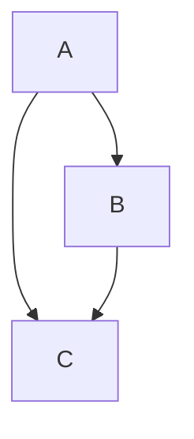

# Mermaid

Use [Mermaid](https://mermaid-js.github.io/mermaid/#/) to create diagrams using text and code, written in a Markdown style.
Surround Mermaid expressions with a fenced block and specify `mermaid` as a language

    ```mermaid
    graph TD; A-->B; A-->C; B-->C;
    ```

The result will be a diagram.



In presentation mode, rendered expressions will automatically scale to make use of the screen space.

Note: Rendering is done by using [Mermaid](https://mermaid-js.github.io/mermaid/#/) library.